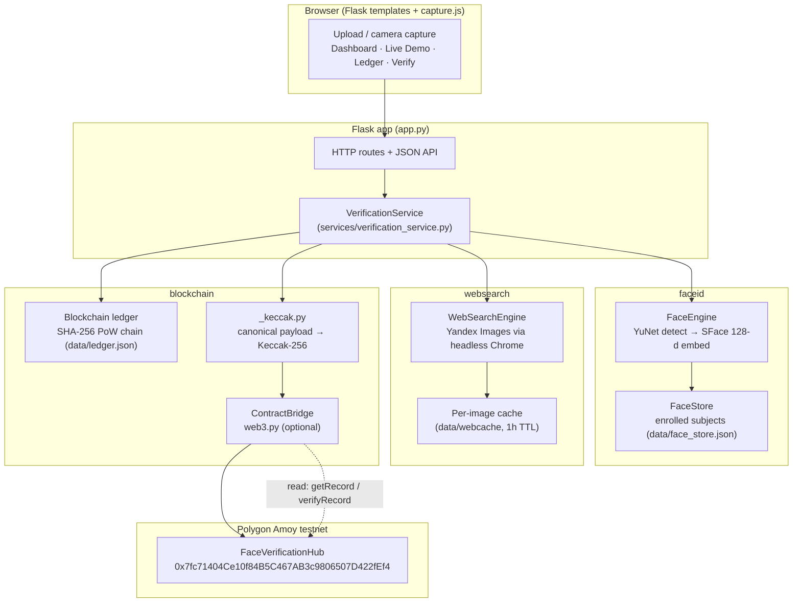
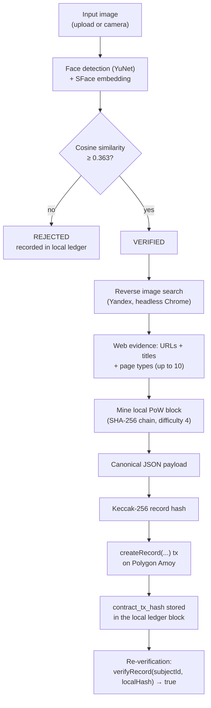
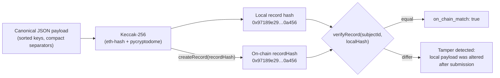
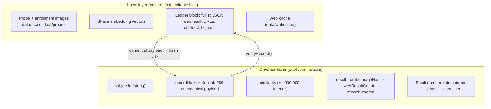

# Face Identification & Blockchain Verification


A pipeline that takes a face scan, identifies the person against enrolled
subjects, runs a **genuine reverse-image search** on the web to discover where
that face appears, and anchors the discovered evidence to the **Polygon Amoy
testnet** as a tamper-evident on-chain record — end to end.

```
Face scan input → Face identification → Web/social media search → Blockchain upload/verification
```

---

## Table of contents

1. [Overview and problem statement](#overview-and-problem-statement)
2. [Why blockchain](#why-blockchain)
3. [Key features](#key-features)
4. [System architecture](#system-architecture)
5. [End-to-end verification workflow](#end-to-end-verification-workflow)
6. [Face identification and matching](#face-identification-and-matching)
7. [Reverse image search and evidence flow](#reverse-image-search-and-evidence-flow)
8. [Canonical record and Keccak-256 hashing](#canonical-record-and-keccak-256-hashing)
9. [Local vs on-chain data](#local-vs-on-chain-data)
10. [Smart contract](#smart-contract)
11. [Blockchain proof example](#blockchain-proof-example)
12. [Repository structure](#repository-structure)
13. [Technology stack](#technology-stack)
14. [Installation](#installation)
15. [Environment variables](#environment-variables)
16. [Running the application](#running-the-application)
17. [Using the system](#using-the-system)
18. [HTTP API](#http-api)
19. [Blockchain verification procedure](#blockchain-verification-procedure)
20. [Security considerations](#security-considerations)
21. [Privacy and biometric considerations](#privacy-and-biometric-considerations)
22. [Limitations](#limitations)
23. [Testing and validation](#testing-and-validation)
24. [Implementation status](#implementation-status)
25. [Architectural decisions](#architectural-decisions)
26. [Roadmap](#roadmap)
27. [Troubleshooting](#troubleshooting)
28. [FAQ](#faq)
29. [License and references](#license-and-references)

---

## Overview and problem statement

Face-matching systems produce a *score*, and scores are easy to dispute after
the fact: someone can alter the stored record, re-run the comparison, or claim
the evidence was fabricated. This project answers two questions at once:

1. **Where does this face appear on the web?** — a scripted reverse-image
   search (Yandex Images via headless Chrome) finds real pages and social
   media posts containing the same face.
2. **Can anyone prove, later, that this exact evidence existed and was not
   altered?** — the pipeline computes a Keccak-256 fingerprint of the
   verification record and writes it to a smart contract on a public testnet,
   where it becomes immutable and publicly checkable on Polygonscan.

The local ledger additionally demonstrates hash-chained tamper evidence with
proof-of-work, and every verification event is re-verifiable both locally and
against the on-chain record.

> **What the blockchain proves — and what it does not.**
> The on-chain record proves the **integrity and timestamp** of the recorded
> verification data: the similarity score, the probe image hash, the result,
> and the number of web results that were found. It does **not** prove that the
> identified person is genuinely that person in the real world. A cosine
> similarity of 0.9999 is a strong *biometric match signal*, not absolute
> proof of identity.

---

## Why blockchain

| Without blockchain | With this project's on-chain anchor |
|---|---|
| Stored verdicts can be edited silently | The record hash is immutable once written |
| "When was this recorded?" is unanswerable | Block timestamp + tx hash answer it publicly |
| Reviewers must trust the operator | Anyone can re-verify on Polygonscan, no access needed |
| Local files are the only evidence | A public, independent copy of the fingerprint exists |

The local ledger remains the fast, private working layer; the smart contract is
the public anchor. Both are bound to the **same Keccak-256 hash**, so altering
the local data after submission breaks the match (demonstrated in
[Blockchain verification procedure](#blockchain-verification-procedure)).

---

## Key features

- **Face detection + encoding** — YuNet detector and SFace 128-d embeddings
  (OpenCV DNN, ONNX models), cosine-similarity matching against enrolled
  subjects, upload *or* live camera capture.
- **Genuine reverse-image search** — the probe image is uploaded to Yandex
  Images through headless Chrome (Selenium). Results are real, classified as
  `social_media` / `image_host` / `blog` / `web`, cached per image for one
  hour, and retried on transient failures. No API key and no pre-picked
  results.
- **Local proof-of-work ledger** — SHA-256 hash-chained blocks (difficulty 4)
  with full verification metadata; `validate_chain()` detects any tampering.
- **On-chain records on Polygon Amoy** — canonical JSON payload → Keccak-256 →
  `FaceVerificationHub.createRecord(...)`; re-verification via
  `verifyRecord(...)`.
- **One-click live demo** — `/demo` runs the whole pipeline on a stored probe
  with an animated stepper and Polygonscan links (built for screen recordings).
- **Transparent status reporting** — every run reports
  `on_chain_submitted` / `on_chain_error` / a precise skip reason. The pipeline
  never fails silently.
- **JSON proof export** — `/api/history/<subject_id>/export` downloads a
  subject's full verification record set as a JSON attachment.
- **36 passing tests** covering the face engine, ledger tamper evidence,
  canonical hash reproducibility, and every HTTP route.

---

## System architecture



---

## End-to-end verification workflow



If the on-chain bridge is not configured, the on-chain steps are skipped and
the run is reported with a precise `on_chain_skipped_reason` — the local ledger
still records the event, and the app says exactly why the write did not happen.

---

## Blockchain / hash verification flow



---

## Local vs on-chain data flow



---

## Face identification and matching

- **Detection:** YuNet face detector (`models/face_detection_yunet_2023mar.onnx`),
  score threshold `0.6`, detection side capped at 640 px for speed.
- **Encoding:** SFace recognizer (`models/face_recognition_sface_2021dec.onnx`)
  produces a 128-d embedding.
- **Matching:** cosine similarity between the probe embedding and every stored
  embedding of every enrolled subject; the best score wins. `VERIFIED` requires
  `≥ 0.363` (OpenCV's recommended SFace threshold, `config.py`:
  `MATCH_THRESHOLD`).
- **Enrollment:** `/register` accepts an upload or a camera capture. A subject
  accumulates up to 3 embeddings (from up to 3 images) and is identified by a
  slug id such as `barack-obama-ee8f7c`.
- **Storage:** `data/face_store.json` (gitignored). Only hashes — never images
  or embeddings — leave the machine.

Both models are downloaded by `python tools/fetch_models.py`.

---

## Reverse image search and evidence flow

`websearch/search.py` drives a real search, not a fixture:

1. Headless Chrome (Selenium 4.6+, anti-automation flags) opens Yandex Images.
2. The probe image is uploaded through the search-by-image file input.
3. Result cards are scraped: destination URL, title, snippet, thumbnail URL.
4. Each hit is classified by domain into `social_media`, `image_host`,
   `blog`, or `web`.
5. Up to 10 results are attached to the verification event and stored in the
   local ledger transaction (`web_search_results`, `web_search_count`).

Resilience details:

- **Retry:** the upload flow is attempted twice per run (Yandex occasionally
  serves a captcha or a slow first page).
- **Cache:** results are cached on disk per SHA-256 of the probe bytes with a
  1-hour TTL, so repeated demos of the same probe are instant. **Empty result
  sets are never cached** — a transient failure is retried on the next run
  instead of being persisted into the cache.
- **Timeout:** 45 s per search (`config.py`: `WEB_SEARCH_TIMEOUT`).

The search runs only when the face is matched, and its result count feeds the
on-chain record (`webResultCount`).

---

## Canonical record and Keccak-256 hashing

`blockchain/_keccak.py` is the **single source of truth** for the exact bytes
that are hashed. The canonical payload is JSON with sorted keys, compact
separators, and UTF-8 encoding:

| Field | Meaning |
|---|---|
| `subject_id` | Subject slug, e.g. `barack-obama-ee8f7c` |
| `similarity` | Full-precision cosine similarity (e.g. `0.9999`) |
| `result` | `VERIFIED` or `REJECTED` |
| `probe_image_hash` | SHA-256 hex of the probe image bytes |
| `web_result_count` | Number of reverse-image results found |
| `record_schema` | Schema version tag (`v1`) |
| `chain` | `polygon-amoy` |
| `local_block_hash` | Local ledger block hash — **included only when set** (keeps legacy records reproducible) |

`recordHash = Keccak-256(canonical JSON bytes)` — the Ethereum Keccak-256
variant, not SHA3-256, computed via `eth-hash` with the `pycryptodome`
backend (web3 is a fallback). This hash is what `createRecord(...)` stores
on-chain and what `verify_contract()` recomputes locally during
re-verification.

> Full-precision similarity lives in the hash. The contract stores a scaled
> integer (`round(similarity × 1,000,000)`) for display; the hash binds the
> exact value.

---

## Local vs on-chain data

| Data | Local ledger (`data/ledger.json`) | On-chain (`FaceVerificationHub`) |
|---|---|---|
| Probe / enrollment images | ✅ stored locally | ❌ never leaves the machine |
| Embedding vectors | ✅ (via their hash) | ❌ hash only, in the local tx |
| Full web result URLs | ✅ in the tx JSON | ❌ count only |
| Similarity | ✅ full precision | integer ×1e6 (hash binds full precision) |
| Verdict + probe hash + result count | ✅ | ✅ |
| Canonical record hash | ✅ recomputed | ✅ stored as `recordHash` |
| Timestamp | block timestamp (local) | block timestamp (public) |
| Tamper evidence | PoW hash chain | immutable, publicly auditable |
| Who can check it | operator only | anyone via Polygonscan |

---

## Smart contract

**Deployed contract (official public proof):**
`FaceVerificationHub` — [`0x7fc71404Ce10f84B5C467AB3c9806507D422fEf4`](https://amoy.polygonscan.com/address/0x7fc71404Ce10f84B5C467AB3c9806507D422fEf4)
on Polygon Amoy (chain id **80002**). Source: `contracts/FaceVerificationHub.sol`,
ABI: `contracts/FaceVerificationHub.abi.json`.

Functions used by the pipeline:

| Function | Type | Purpose |
|---|---|---|
| `createRecord(subjectId, recordHash, similarity, result, probeImageHash, webResultCount[, localBlockHash])` | tx | Store/overwrite a subject's record hash; emits `RecordCreated` |
| `getRecord(subjectId)` | view | Read the stored `recordHash` |
| `getRecord(subjectId, includeLocalBlockHash)` | view | Read `recordHash` + `localBlockHash` |
| `verifyRecord(subjectId, expectedHash)` | view | `true` when the stored hash equals `expectedHash` |
| `verifyLatest(subjectId)` | tx | Re-verify the latest record; emits `RecordVerified` |
| `recordCount()` | view | Number of records ever created |
| `RECORD_SCHEMA()` | view | Record schema version (`v1`) |

**Deployment-version note (important):** the contract *source* in this repo
includes the newer overloads that accept a `localBlockHash` traceability
field. The **currently deployed** instance predates those overloads. The
Python bridge therefore **feature-detects** the 7-arg `createRecord` selector
in the deployed runtime bytecode at startup:

- overload present → the traceability field is attached on-chain;
- overload absent (the current deployment) → the bridge falls back to the
  legacy 6-arg `createRecord`, and the `local_block_hash` traceability is kept
  in the local ledger only. No transaction ever reverts from calling a missing
  overload.

`createRecord` is currently un-gated so the demo pipeline can write records;
gating submitter addresses is listed as future work.

---

## Blockchain proof example

One verified, publicly checkable demonstration (values are from that specific
execution, not generic claims about every run):

| Field | Value |
|---|---|
| Subject ID | `barack-obama-ee8f7c` |
| Similarity | `0.9999` |
| Web results found | `10` |
| Local record hash | `0x97189e2976e5009b8d221605aacb00398100d7974363eab455e6f006d970a456` |
| On-chain record hash | `0x97189e2976e5009b8d221605aacb00398100d7974363eab455e6f006d970a456` |
| Match | **exact** — `verifyRecord(...)` returned `true` |
| Transaction | [`0x0abb16c8429166476a85aa2606fb743404d264e98129fbf2938a6208c9ebb9ae`](https://amoy.polygonscan.com/tx/0x0abb16c8429166476a85aa2606fb743404d264e98129fbf2938a6208c9ebb9ae) |
| Polygon block | `46874016` |
| Gas used | `54270` |
| Status | `SUCCESS` |

Public links:

- Transaction: <https://amoy.polygonscan.com/tx/0x0abb16c8429166476a85aa2606fb743404d264e98129fbf2938a6208c9ebb9ae>
- Contract: <https://amoy.polygonscan.com/address/0x7fc71404Ce10f84B5C467AB3c9806507D422fEf4>

---

## Repository structure

```
.
├── app.py                              # Flask app: pages, JSON API, /demo, /health
├── config.py                           # Paths, thresholds, difficulty, HOST/PORT/FLASK_DEBUG
├── pytest.ini                          # Test discovery scoped to tests/
├── conftest.py                         # Makes the project root importable
├── requirements.txt                    # Python dependencies
├── Dockerfile                          # python:3.11-slim + Chrome + gunicorn
├── .dockerignore
├── .env.example                        # Env template (never commit a real .env)
├── blockchain/
│   ├── __init__.py
│   ├── block.py                        # Block model; hash covers every field
│   ├── ledger.py                       # PoW chain, validate_chain(), subject history
│   ├── _keccak.py                      # Canonical payload + Keccak-256 (single source of truth)
│   └── contract.py                     # ContractBridge: submit/read/verify on Polygon Amoy
├── contracts/
│   ├── FaceVerificationHub.sol         # Deployed contract source (Solidity ^0.8.20)
│   └── FaceVerificationHub.abi.json    # ABI used by the Python bridge
├── faceid/
│   ├── engine.py                       # YuNet detection + SFace embedding
│   ├── similarity.py                   # Cosine similarity
│   └── store.py                        # Subject registry (embeddings, images)
├── websearch/
│   └── search.py                       # Yandex reverse-image search (Selenium)
├── services/
│   └── verification_service.py         # Pipeline orchestration + on-chain status
├── static/
│   ├── style.css                       # UI styling (dark theme, stepper, spinner)
│   └── capture.js                      # Camera capture for register/identify
├── templates/                          # Jinja2 pages (index, demo, identify, ledger, …)
├── tests/
│   ├── test_app.py                     # Route + API integration tests
│   ├── test_blockchain.py              # Ledger, PoW, tamper detection
│   ├── test_faceid.py                  # Similarity + store round-trips
│   └── test_phase4.py                  # Record builder, hash reproducibility, cross-check
├── tools/
│   ├── demo_pipeline.py                # End-to-end CLI demo
│   ├── tamper_demo.py                  # Visual tamper-evidence demonstration
│   ├── export_onchain_proof.py         # Prints the full local + on-chain proof
│   ├── contract.py                     # CLI: submit / verify / example-config
│   ├── fetch_models.py                 # Downloads YuNet + SFace ONNX models
│   ├── test_contract_connection.py     # Standalone bridge connectivity check
│   ├── test_contract_write.py          # Standalone bridge write check
│   └── config_chain.example.py         # Template for the gitignored config_chain.py
└── docs/
    ├── IMPLEMENTATION-STATUS.md        # Feature + phase delivery summary
    ├── onchain-proof.md                # Public on-chain proof trail
    ├── SMART_CONTRACT.md               # Contract notes
    ├── recording-guide.md              # Screen-recording checklist
    ├── recording-plan.md
    ├── phase2-checklist.md
    ├── phase3-roadmap.md
    ├── phase4-roadmap.md
    ├── ROADMAP.md                      # Full phased roadmap
    └── DEPLOYMENT.md                   # Docker / PaaS deployment notes
```

Runtime directories (gitignored, created on first run): `data/` (ledger,
face store, faces, probes, web cache) and `models/` (ONNX files).

---

## Technology stack

| Layer | Technology |
|---|---|
| Language | Python 3.11+ |
| Web | Flask 3.x, Jinja2 templates, vanilla JS (`capture.js`) |
| Computer vision | OpenCV (`opencv-contrib-python`) DNN — YuNet + SFace ONNX |
| Data / imaging | NumPy, Pillow |
| Web search | Selenium 4.6+ driving Google Chrome headless against Yandex Images |
| Local ledger | Custom SHA-256 proof-of-work chain (difficulty 4), JSON persistence |
| Hashing | `eth-hash` (+ `pycryptodome` backend) for Keccak-256; `hashlib` for SHA-256 |
| Blockchain | Solidity ^0.8.20, Polygon Amoy testnet (chain id 80002), web3.py bridge (optional install) |
| Serving (Docker) | gunicorn, 2 workers, 120 s timeout |
| Testing | pytest (36 tests) |

---

## Installation

### 1. Prerequisites

- Python 3.11+
- Google Chrome installed (the reverse-image search drives it headlessly)
- For on-chain features: a funded **Polygon Amoy testnet** wallet (faucet:
  <https://faucet.polygon.technology/>)

### 2. Create a virtual environment and install dependencies

Windows:

```bash
python -m venv .venv
.venv\Scripts\pip install -r requirements.txt
# Optional on-chain bridge dependencies:
.venv\Scripts\pip install web3 "eth-hash[pycryptodome]"
```

Linux/macOS:

```bash
python3 -m venv .venv
.venv/bin/pip install -r requirements.txt
.venv/bin/pip install web3 "eth-hash[pycryptodome]"
```

> Note: the first line of `requirements.txt` is currently an invalid
> requirement (`Flask web framework` instead of `flask>=3.0`). If
> `pip install -r requirements.txt` rejects it, install the packages directly:
> `pip install "flask>=3.0" "opencv-contrib-python>=4.10" "numpy>=1.26" "Pillow>=10.0" "pytest>=8.0" "selenium>=4.6"`.
> See [Troubleshooting](#troubleshooting).

### 3. Download the face models

```bash
python tools/fetch_models.py
```

This fetches `face_detection_yunet_2023mar.onnx` and
`face_recognition_sface_2021dec.onnx` into `models/`.

### 4. (Optional) configure the on-chain bridge

```bash
cp tools/config_chain.example.py config_chain.py
# then edit config_chain.py — it is gitignored
```

### Docker alternative

```bash
docker build -t face-chain-verify .
docker run --rm -p 5000:5000 face-chain-verify
```

The image bundles Chrome and gunicorn; models are fetched at build time.

---

## Environment variables

The Flask app itself:

| Variable | Default | Purpose |
|---|---|---|
| `HOST` | `127.0.0.1` | Bind address (`0.0.0.0` in Docker/PaaS) |
| `PORT` | `5000` | Bind port |
| `FLASK_DEBUG` | `0` | `1` enables Flask debug mode |
| `FCV_DATA_DIR` | `<repo>/data` | Overrides the data directory (used by tests) |

On-chain bridge — preferred way is the gitignored `config_chain.py`
(see `tools/config_chain.example.py`):

| Key | Purpose |
|---|---|
| `POLY_AMOY_RPC` | RPC endpoint, e.g. `https://rpc-amoy.polygon.technology` |
| `CONTRACT_ADDRESS` | Deployed `FaceVerificationHub` address |
| `PRIVATE_KEY` | **Testnet-only** wallet key — never commit |
| `CHAIN_ID` | `80002` |

Deployment platforms that prefer env vars can instead set `WEB3_RPC_URL`,
`CONTRACT_ADDRESS`, and `PRIVATE_KEY`; the bridge falls back to them when
`config_chain.py` is missing or incomplete. See `.env.example`.

**No secrets are stored in the repository.** `config_chain.py`, `.env`, and
`data/` are gitignored.

---

## Running the application

```bash
python app.py
```

Then open <http://127.0.0.1:5000>. For Docker:

```bash
docker run --rm -p 5000:5000 face-chain-verify
```

The app boots even without models or bridge config — `/health` reports
`degraded` in that case instead of crashing.

---

## Using the system

1. **Register a face** — `/register`: upload a photo or capture from the
   camera. The subject is enrolled and the registration is mined into the
   local ledger.
2. **Identify** — `/identify`: submit a probe. The pipeline matches the face,
   (on match) runs the reverse-image search, mines the ledger block, and — if
   the bridge is configured — writes the record on-chain. A progress indicator
   shows each stage; the search can take up to ~45 s.
3. **Live demo** — `/demo`: one click runs the entire pipeline on a stored
   sample probe (`obama-probe.jpg`), with an animated stepper and Polygonscan
   links for the result. This is the page used for screen recordings.
4. **Ledger** — `/ledger`: browse every block and transaction.
5. **Verify** — `/verify`: full chain validation report (tamper evidence).
6. **Subject history** — `/history/<subject_id>`: every event for a subject,
   with probe/embedding hashes, discovered posts, and block linkage.
7. **On-chain cross-check** — `/history/<subject_id>/contract`: local hash vs
   on-chain hash, `verifyRecord()` result, tx hash, Polygonscan links.

CLI alternatives:

```bash
python tools/demo_pipeline.py                    # end-to-end demo in the terminal
python tools/demo_pipeline.py --probe path/to.jpg
python tools/tamper_demo.py                      # tamper-evidence demonstration
python tools/export_onchain_proof.py --subject-id barack-obama-ee8f7c
python tools/contract.py verify --subject-id barack-obama-ee8f7c
```

---

## HTTP API

All routes as registered in `app.py`:

| Method | Route | Purpose |
|---|---|---|
| GET | `/` | Dashboard (stats, subjects, recent events) |
| GET | `/health` | Liveness probe; `503` when models are missing |
| GET | `/api/status` | Models, subject count, ledger stats |
| POST | `/api/register` | Enroll a face (`image` multipart file or `image_data` base64) |
| POST | `/api/identify` | Full pipeline on a probe |
| GET | `/demo` | One-click demo page |
| POST | `/demo/run` | Run the pipeline on a stored sample (`sample` form field) |
| GET | `/ledger` | Ledger page (HTML) |
| GET | `/verify` | Chain-validation page (HTML) |
| GET | `/api/chain` | Full chain: stats + every block |
| GET | `/api/chain/validate` | Tamper-evidence validation report |
| GET | `/history/<subject_id>` | Subject history page (HTML) |
| GET | `/api/history/<subject_id>` | Subject events (JSON) |
| GET | `/history/<subject_id>/contract` | On-chain cross-check page (HTML) |
| GET | `/api/history/<subject_id>/contract` | On-chain cross-check report (JSON) |
| GET | `/api/history/<subject_id>/export` | Download the subject's verification records as JSON |
| GET | `/web-results/<int:block_index>` | Web results found in a specific block (HTML) |
| GET | `/api/docs` | Rendered API reference |
| GET | `/media/<path:relpath>` | Serves stored enrollment/probe images (local demo only) |

Example:

```bash
curl -F "image=@probe.jpg" http://127.0.0.1:5000/api/identify
curl http://127.0.0.1:5000/api/chain/validate
curl http://127.0.0.1:5000/api/history/barack-obama-ee8f7c/contract
```

---

## Blockchain verification procedure

Anyone can re-verify the published record without access to this machine:

1. **Polygonscan (no setup):** open the
   [transaction](https://amoy.polygonscan.com/tx/0x0abb16c8429166476a85aa2606fb743404d264e98129fbf2938a6208c9ebb9ae)
   — status SUCCESS, block 46874016, interacting with
   `0x7fc71404Ce10f84B5C467AB3c9806507D422fEf4`. On the contract page, read
   `getRecord("barack-obama-ee8f7c")` and compare with
   `0x97189e2976e5009b8d221605aacb00398100d7974363eab455e6f006d970a456`.
2. **From the app:** `GET /api/history/barack-obama-ee8f7c/contract` →
   `local_record_hash`, `on_chain_record_hash`, `on_chain_match: true`,
   `contract_tx_hash`.
3. **From the CLI:** `python tools/contract.py verify --subject-id barack-obama-ee8f7c`
   (requires `config_chain.py` + web3), or
   `python tools/export_onchain_proof.py --subject-id barack-obama-ee8f7c`
   for the full local + on-chain + traceability proof.

**Tamper evidence in practice:** `tools/tamper_demo.py` modifies a copy of the
ledger and shows `validate_chain()` flip to `valid: false`, because each block
hash covers every field (transactions, previous hash, nonce). Likewise, any
change to a submitted verification's data changes the Keccak-256 record hash
and breaks the match with the on-chain `recordHash`.

---

## Security considerations

- **Keys:** the wallet private key lives only in the gitignored
  `config_chain.py` (or env vars). It must be a **testnet-only** key. Nothing
  secret is committed.
- **Contract gating:** the deployed `createRecord` is intentionally un-gated
  for the demo; production use would restrict submitters (`msg.sender`
  allowlist). `records[subjectId]` is latest-wins: a later submission
  overwrites the subject's hash.
- **Transport:** the demo binds to loopback; the Dockerfile exposes HTTP
  without TLS — put a reverse proxy with HTTPS in front for any public
  deployment.
- **Search trust:** results come from a third-party search engine and are
  stored as *discovered evidence*; the on-chain record binds the count and the
  probe hash, not the continued availability of those URLs.
- **`/media` route:** serves files under the project directory for the local
  demo; disable it before any public deployment.

---

## Privacy and biometric considerations

- Face images, probe images, and SFace embeddings stay in the local, gitignored
  `data/` directory. **Only hashes and counts ever go on-chain.**
- On-chain data (`subjectId`, similarity, result, probe-image hash, result
  count) is public by design. The probe-image hash is a one-way fingerprint;
  it does not expose the image.
- **Biometric matching is probabilistic.** A similarity of `0.9999` against a
  threshold of `0.363` is strong evidence of a *match to the enrolled
  embedding*, not legal proof of identity. The blockchain proves the integrity
  and timestamp of the recorded data — it does not independently confirm that
  the identified person is that person.
- Suitable only for demo/educational use; real deployments need consent
  flows, retention limits, and applicable biometric-privacy compliance.

---

## Limitations

- **Search fragility:** the Yandex flow depends on their live UI; selector
  changes, captchas, or regional variants can degrade results (mitigated by a
  retry, staged fallbacks, and caching — but not eliminated).
- **Result variance:** result counts differ between runs and engines; the
  cached count is what gets anchored on-chain for a given probe.
- **Contract version:** the deployed instance predates the `localBlockHash`
  overloads present in the source; the bridge feature-detects and keeps that
  traceability locally for the current deployment.
- **Latest-wins registry:** the contract stores one hash per subject (the most
  recent submission), not a full history.
- **Local ledger ≠ consensus:** the PoW chain demonstrates tamper evidence,
  not distributed consensus; the public anchor is the Polygon record.
- **Testnet:** Polygon Amoy is free and its history can in principle be
  pruned; production anchors would use mainnet.
- **Single-operator identity:** subject ids are self-registered slugs; nothing
  on-chain attests that `barack-obama-ee8f7c` is the real person.

---

## Testing and validation

36 tests, all passing (`python -m pytest`):

| Suite | Covers |
|---|---|
| `tests/test_faceid.py` | Cosine similarity math, store round-trips, match/no-match, embedding cap, persistence |
| `tests/test_blockchain.py` | Genesis validity, PoW difficulty, block linking, **tamper detection**, subject history, hash sensitivity to every field |
| `tests/test_app.py` | Every page and API route, error paths (missing image, faceless image), demo fallbacks, export headers |
| `tests/test_phase4.py` | Verification-record builder, bridge-off fallback, `local_block_hash` cross-check, **canonical hash reproducibility of the published on-chain proof**, chain-config precedence, deployed-bytecode feature detection |

Manual/live validation performed during development:

- End-to-end `/demo` run: `VERIFIED`, similarity `1.0` / `0.9999`, 10 real web
  results, block mined, tx confirmed on Polygon Amoy (see
  [proof example](#blockchain-proof-example)).
- Live re-verification: `verify_contract()` returns `on_chain_match: true`
  with the exact documented hash.
- Tamper demo: altered ledger copy → `valid: false`.

---

## Implementation status

- ✅ Face detection + encoding + matching (YuNet + SFace)
- ✅ Genuine reverse-image search with retry + non-empty-cache policy
- ✅ Local PoW ledger with tamper demo
- ✅ Smart contract written, deployed on Polygon Amoy, integrated via web3
- ✅ Canonical Keccak-256 record hash (single source of truth)
- ✅ On-chain submission + re-verification (app, API, CLI)
- ✅ One-click `/demo` page with stepper (recording-friendly)
- ✅ Loading states, transparent on-chain status/skip reporting
- ✅ `/api/docs`, JSON proof export, `/health`
- ✅ Docker packaging (Chrome included), `.env.example`
- ✅ 36 automated tests
- ⚪ Live cloud hosting — scaffolding ready, intentionally not deployed (not
  required by the task)
- ⚪ Contract submitter gating, multi-engine search, batch uploads — future work

---

## Architectural decisions

1. **Hash-first proof model.** Only a Keccak-256 fingerprint of the canonical
   record goes on-chain — cheap, private, and sufficient for tamper evidence.
2. **Single source of truth for hashing.** `blockchain/_keccak.py` is the only
   place that builds the canonical payload; both submission and
   re-verification call it, eliminating drift.
3. **Keccak-256 (Ethereum variant), not SHA3-256**, to match Solidity's
   `keccak256` and keep the local hash byte-identical to the on-chain hash.
4. **Local ledger stays.** Fast, private, demoable offline; cross-referenced
   with the chain via `contract_tx_hash` (and `local_block_hash` where the
   deployment supports it).
5. **Feature-detect the deployment.** The bridge inspects the deployed runtime
   bytecode and adapts (7-arg vs 6-arg `createRecord`), so the published proof
   is never invalidated by source-level contract evolution.
6. **Graceful degradation everywhere.** Missing models → `/health: degraded`;
   missing bridge → local-only run with an explicit skip reason; failed search
   → run continues with zero results, never cached.
7. **The deployed `FaceVerificationHub` remains the official public proof.**
   Later improvements (richer local records, traceability fields) live in the
   application layer and do not change the canonical payload for existing
   records.

---

## Roadmap

- [ ] Gate `createRecord` to authorized submitter addresses (would be a fresh
      deployment, not a mutation of the current proof)
- [ ] Store a per-subject history on-chain (events instead of latest-wins)
- [ ] Multi-engine search aggregation (Bing / Google Lens) with per-engine
      evidence
- [ ] Batch identify + CSV/JSON bulk export
- [ ] Live cloud deployment (Docker image is ready for Render/Railway/VPS)
- [ ] Optional post-content enrichment for discovered social posts via
      platform APIs

---

## Troubleshooting

| Symptom | Cause / fix |
|---|---|
| `pip install -r requirements.txt` fails with `InvalidRequirement` on `Flask web framework` | The first line of `requirements.txt` is a comment-like sentence rather than a valid requirement. Install the packages directly (see [Installation](#installation)) or change that line to `flask>=3.0`. |
| `Could not start a headless browser` | Chrome is missing or a chromedriver mismatch. Install Google Chrome; Selenium 4.6+ auto-manages the driver. |
| `No face detected` on a valid-looking photo | Face too small or low quality; use a frontal, well-lit image with the face ≥ ~100 px. |
| `/health` reports `degraded` | ONNX models missing — run `python tools/fetch_models.py`. |
| Demo shows "On-chain bridge not configured" | `config_chain.py` missing/empty or env vars unset. The run is local-only; configure the bridge for on-chain writes. |
| `On-chain write failed: ...` | Fund the Amoy wallet (faucet), check RPC reachability, and confirm the contract address. The exact error is shown in the UI and logs. |
| Web search returns 0 results | Usually a captcha or slow first page — run again (empty results are not cached). Check Chrome and network. |
| `Cannot connect to RPC` | Public RPC hiccup — retry, or point `POLY_AMOY_RPC` at another Amoy RPC provider. |
| Model download fails | Fetch manually (links inside `tools/fetch_models.py`) into `models/`. |

---

## FAQ

**Which blockchain is used?**
Polygon Amoy testnet (chain id 80002), contract
[`0x7fc71404Ce10f84B5C467AB3c9806507D422fEf4`](https://amoy.polygonscan.com/address/0x7fc71404Ce10f84B5C467AB3c9806507D422fEf4).

**Is the search real or scripted to fixed results?**
Real. The probe image is uploaded to Yandex Images at run time via headless
Chrome; whatever it returns is what gets recorded. Nothing is pre-picked.

**What exactly goes on-chain?**
A Keccak-256 hash of the canonical verification record (subject, similarity,
result, probe-image hash, web-result count, schema, chain — plus the local
block hash when supported), along with the display fields stored by
`createRecord`. Images and embeddings never leave the machine.

**Why Keccak-256 instead of SHA-256 for the record hash?**
The Solidity contract compares against hashes computed with Ethereum's
`keccak256`. Using the same function locally makes the local hash and the
on-chain `recordHash` byte-identical. (The local *ledger* separately uses
SHA-256 for its PoW chain.)

**Does a match prove identity?**
No. It proves a strong biometric similarity to the enrolled embeddings. The
blockchain proves the recorded data has not been altered since submission —
not that the person is who the label says.

**Can I run it fully offline?**
Face identification and the local ledger work offline. The web search needs
internet, and on-chain features need an RPC connection.

---

## License and references

- **License:** none added yet (the repository currently has no LICENSE file).
- Contract source: `contracts/FaceVerificationHub.sol` (SPDX: MIT header).
- OpenCV YuNet/SFace: <https://github.com/opencv/opencv_zoo>
- Polygon Amoy: <https://polygon.technology/developers>
- web3.py: <https://web3py.readthedocs.io/>
- Selenium: <https://www.selenium.dev/>
- Flask: <https://flask.palletsprojects.com/>

---

*Proof values in this README reflect the specific verified demo execution
documented in `docs/onchain-proof.md`; new runs produce their own hashes and
transaction hashes.*
